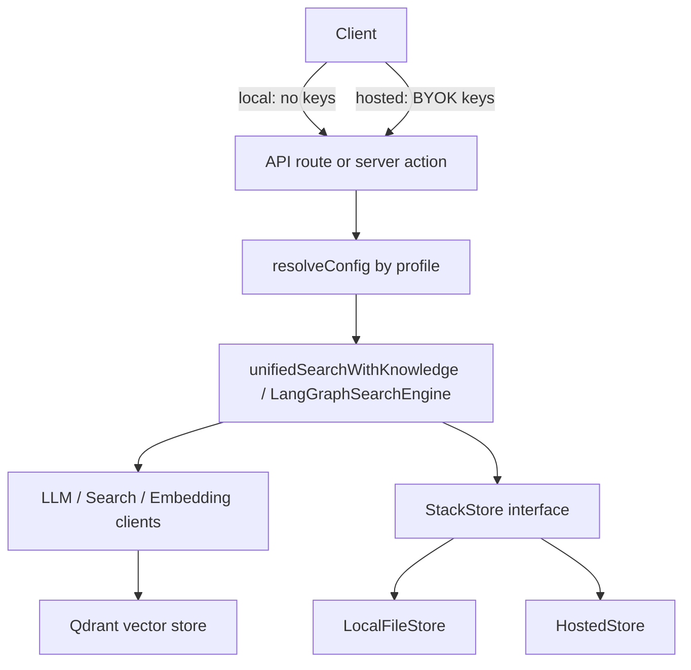

# Narada AI: Local-First, Then Demo-Ready

This plan is ordered local-first, then demo. Part A makes the app correct and trustworthy when run locally (single process, secrets in `.env.local`). Part B adds the constrained, BYOK-based hosted demo and deployment ergonomics. The backbone is a `RUNTIME_PROFILE` (`local` | `hosted`) plus threading credentials and storage through explicit interfaces instead of global `process.env` / a module singleton (Option A from brainstorming).

## Key decisions (locked from brainstorming)

- Targets: self-hosted container AND a constrained Vercel demo.
- Hosted model: BYOK. Visitors supply keys per session; nothing secret is persisted server-side.
- RAG scope: real extraction now. PDF/DOCX work in both profiles; OCR is local-only (tesseract.js too heavy for Vercel).

## Architecture seams this plan relies on

- LLM/embedding clients already accept `overrideConfig`; `UnifiedSearchClient` already accepts `providedApiKey`. We thread a per-request `ResolvedConfig` into these instead of each constructor calling `getAppConfig()`.
- Two engine entry points must both be updated: [app/api/search-with-knowledge/route.ts](app/api/search-with-knowledge/route.ts) and the server action [components/search/search-with-knowledge.tsx](components/search/search-with-knowledge.tsx) (note its unused `_firecrawlApiKey`).
- The vector store is a singleton built at import: `export const vectorStore = createVectorStore()` in [lib/vector-store.ts](lib/vector-store.ts). For BYOK its embedding calls need per-request credentials.

---

# PART A: LOCAL-FIRST

## Phase 0: Correctness fixes (benefit both profiles)

### 0.1 Real document extraction

- Rewrite [lib/text-extraction.ts](lib/text-extraction.ts): remove `simulatePdfExtraction` / `simulateDocxExtraction` / `simulateImageOcr`.
- PDF via `unpdf` or `pdf-parse`; DOCX via `mammoth`; OCR via `tesseract.js` (guarded to local profile).
- Add real guards in [app/api/knowledge-stacks/[stackId]/upload/route.ts](app/api/knowledge-stacks/[stackId]/upload/route.ts): max file size, max file count, MIME/extension allow-list, and honest rejection of unsupported types (no fabricated content). Stop returning raw `error.message` to clients; route through [lib/error-handler.ts](lib/error-handler.ts).

### 0.2 Robust LLM JSON parsing

- Add a shared `safeParseJson` helper that strips fences (the logic already exists inline near line 1096 of [lib/langgraph-search-engine.ts](lib/langgraph-search-engine.ts)).  
- Apply it in `extractSubQueries` (line ~1168) which currently calls bare `JSON.parse(response.content)` and silently degrades to single-query mode. Log parse failures.  
  
### 0.3 Vector ID collision fix  
- Replace `generateNumericId` (32-bit hash) in [lib/qdrant-vector-store.ts](lib/qdrant-vector-store.ts) with a deterministic UUID (`uuidv5(vectorId, NAMESPACE)`; `uuid` is already a dependency). Qdrant accepts UUID point IDs.  
- Migration note: existing collections must be re-indexed; document a recreate step in deployment docs.  
  
### 0.4 Timeouts and stream cancellation  
- Add `AbortController` + timeout to every `fetch` in [lib/langgraph-llm-client.ts](lib/langgraph-llm-client.ts) (and scrape calls), so a hung upstream can't pin a request for the full duration.  
- Thread `request.signal` from [app/api/search-with-knowledge/route.ts](app/api/search-with-knowledge/route.ts) into the engine; on client disconnect, stop the pipeline and guard `controller.enqueue` against a closed controller.  
  
## Phase 1: Local-first runtime and hardening  
  
### 1.1 Runtime profile  
- New `lib/runtime.ts`: `RUNTIME_PROFILE` (default `local`), plus `isLocal()` / `isHosted()` helpers driven by an env var.  
  
### 1.2 Fix settings-vs-process.env staleness (local correctness bug)  
- Today [lib/app-config.ts](lib/app-config.ts) `getAppConfig()` reads `process.env`, but [app/api/settings/route.ts](app/api/settings/route.ts) writes `.env.local`, so saved settings have no effect until restart.  
- In local profile, resolve config by reading `.env.local` at request time (cached with invalidation on write) instead of `process.env`, OR explicitly surface a "restart required" state. Prefer file-read-at-request for a smooth demo.  
  
### 1.3 Guard dangerous endpoints to local-only  
- Wrap POST in [app/api/settings/route.ts](app/api/settings/route.ts) and all of [app/api/settings/reveal/route.ts](app/api/settings/reveal/route.ts) so they return 404/403 unless `isLocal()`. These never run in hosted.  
- Audit [app/api/check-env/route.ts](app/api/check-env/route.ts) and `app/api/debug/*` similarly; keep them local-only or strip sensitive posture in hosted.  
  
### 1.4 StackStore interface  
- Extract a `StackStore` interface from [lib/knowledge-stack-store.ts](lib/knowledge-stack-store.ts); keep current disk behavior as `LocalFileStore` (`.narada-stacks.json`). This is the seam `HostedStore` plugs into later.  
- Make store init explicit/lazy rather than disk I/O in the constructor at import time.  
- Add `.narada-stacks.json` to [.gitignore](.gitignore) (currently tracked) so document text never lands in git.  
  
---  
  
# PART B: DEMO  
  
## Phase 2: BYOK hosted demo  
  
### 2.1 Per-request credential threading (ResolvedConfig)  
- Define a `ResolvedConfig` (search/LLM/embedding provider + keys + urls + models). Build it per request: from file/env in `local`, from validated BYOK fields in `hosted`.  
- Thread it through `unifiedSearchWithKnowledge` (currently constructs `new UnifiedSearchClient()` / engine with no creds) into the engine, LLM client (`overrideConfig`), `UnifiedSearchClient` (`providedApiKey`), and embedding client.  
- Wire BYOK from both entry points: REST body in [app/api/search-with-knowledge/route.ts](app/api/search-with-knowledge/route.ts), and the placeholder `_firecrawlApiKey` (generalize to all keys) in [components/search/search-with-knowledge.tsx](components/search/search-with-knowledge.tsx). Keys are per-session client-side, sent per request, never written to disk.  
  
### 2.2 Vector store + embeddings under BYOK  
- The singleton `vectorStore` ([lib/vector-store.ts](lib/vector-store.ts)) embeds with a single global key. For hosted, make `addDocument` / `searchSimilar` accept a per-request embedding client (or creds) so embeddings use the visitor's key.  
- Hosted Qdrant: point to Qdrant Cloud; scope all points by a per-session `stackId` namespace; treat hosted stacks as ephemeral.  
  
### 2.3 Hosted store + serverless constraints  
- Implement `HostedStore` (session-scoped, ephemeral): use `/tmp` and/or Upstash Redis (`@upstash/redis` already a dependency). No cross-instance persistence assumptions.  
- OCR disabled in hosted (PDF/DOCX only); enforce stricter upload size limits suitable for serverless.  
  
### 2.4 Abuse protection (hosted)  
- Apply `isRateLimited` ([lib/rate-limit.ts](lib/rate-limit.ts)) to `search-with-knowledge` and the `knowledge-stacks` upload/search routes (currently only `models`/`settings/test` are limited).  
- Fix spoofable IP in `getIP`: trust only platform-provided client IP, not raw `x-forwarded-for`.  
  
## Phase 3: Deployment ergonomics and docs  
  
### 3.1 Container self-host  
- Validate the existing [Dockerfile](Dockerfile) standalone build for `RUNTIME_PROFILE=local`.  
- Add/verify a `docker-compose` that brings up app + Qdrant (+ optional Ollama) for a one-command local full stack.  
  
### 3.2 Vercel demo config  
- Remove the dead `app/firesearch/search.tsx` reference in [vercel.json](vercel.json).  
- Document required hosted env (`RUNTIME_PROFILE=hosted`, Qdrant Cloud URL/key, Upstash) and the BYOK UX.  
  
### 3.3 Docs  
- Split README/docs into a local-first quickstart and a hosted-demo (BYOK) section; correct the current "Deploy to Vercel" claims to reflect the constrained demo.  
  
## Out of scope (YAGNI for a demo)  
- Multi-user auth / per-user accounts (BYOK + ephemeral covers the demo).  
- Background job queue for ingestion (inline extraction is fine at demo scale).  
- Horizontal-scale shared state beyond ephemeral hosted store.  
  
## Risks / migration  
- Vector ID change (0.3) and any embedding-dimension change require recreating Qdrant collections.  
- Switching real extraction invalidates previously "ingested" fake content; existing demo stacks should be re-uploaded.  
- BYOK threading touches both engine entry points; verify the server-action path and REST path stay in sync.

