# Narada AI - Deep Research Agent

<div align="center">
  
  <h2>🔍 Intelligent Multi-Source Research</h2>
  <p><strong>Narada AI Deep Research Agent</strong> – A powerful, locally-run research assistant that combines agentic web search, local knowledge bases, and extensible tool support.</p>
</div>

Welcome to **Narada AI Deep Research Agent** – your comprehensive research companion powered by [Firecrawl](https://www.firecrawl.dev/), [Tavily](https://tavily.com), and advanced AI orchestration.

## 🌟 Features

- **🔍 Agentic Web Search**: Multi-layered search using Tavily API and Firecrawl for comprehensive coverage
- **🤖 Local LLM Support**: Full integration with Ollama for local LLMs and embedding models  
- **📚 Local Knowledge Bases**: Powered by Qdrant vector database for document search and retrieval
- **🔧 MCP Server Support**: Extensible architecture supporting Model Context Protocol servers
- **📱 Responsive UI**: Modern, clean interface built with Next.js and Tailwind CSS
- **🔒 Privacy-First**: All data processing can be done locally for maximum privacy
- **🧠 Smart Query Decomposition**: Breaks complex queries into multiple focused searches
- **✅ Answer Validation**: Verifies sources contain actual answers (0.7+ confidence threshold)
- **🔄 Auto-Retry Logic**: Alternative search terms for unanswered questions
- **📊 Real-time Progress**: Live updates as searches complete with detailed status
- **📖 Full Citations**: Every fact linked to its source with transparent attribution
- **💭 Context Memory**: Follow-up questions maintain conversation context across sessions

## 🏗️ Architecture

Narada AI Deep Research Agent consists of several key components working in harmony:

1. **Frontend**: Next.js 15 with React and Tailwind CSS for modern, responsive UI
2. **Backend**: Next.js API routes handling business logic and orchestration
3. **Core Agent**: Multi-agent orchestration system with intelligent query processing
4. **External Integrations**:
   - **Tavily API** for comprehensive web search
   - **Firecrawl** for advanced web content extraction and scraping
   - **Ollama** for local LLMs and embeddings (privacy-first)
   - **Qdrant** for vector storage and semantic search
   - **MCP servers** for extensible tool support
5. **AI Models**: OpenAI GPT-4o for search planning and LangGraph for workflow orchestration

## 🚀 Quick Start

### Prerequisites

- Node.js (v18 or later)
- Docker and Docker Compose
- Ollama installed locally (for LLM support)

### Option 1: Docker Compose (Recommended)

1. Clone the repository:
```bash
git clone https://github.com/AishSoni/Narada-AI.git
cd Narada-AI
```

2. Copy environment variables:
```bash
cp .env.example .env.local
```

3. Edit `.env.local` with your configuration:
```env
# Required: Get from tavily.com
TAVILY_API_KEY=your_tavily_api_key_here

# Required: Get from firecrawl.dev
FIRECRAWL_API_KEY=your_firecrawl_key

# Required: Get from openai.com
OPENAI_API_KEY=your_openai_key

# Ollama Configuration (adjust if needed)
OLLAMA_API_URL=http://host.docker.internal:11434
OLLAMA_EMBEDDING_MODEL=nomic-embed-text
OLLAMA_LLM=llama3.1

# Auto-configured for Docker
QDRANT_API_URL=http://localhost:6333
```

4. Start the services:
```bash
docker-compose up --build
```

5. Open your browser to `http://localhost:3000`

### Option 2: Local Development

1. Install dependencies:
```bash
npm install
```

2. Start Qdrant locally:
```bash
docker run -p 6333:6333 -p 6334:6334 qdrant/qdrant
```

3. Make sure Ollama is running:
```bash
ollama serve
```

4. Install required models:
```bash
ollama pull llama3.1
ollama pull nomic-embed-text
```

5. Start the development server:
```bash
npm run dev
```

## ⚙️ Configuration

### 1. Tavily API Setup

1. Sign up at [tavily.com](https://tavily.com)
2. Get your API key
3. Add it to your environment variables or settings page

### 2. Firecrawl API Setup (Optional)

1. Sign up at [firecrawl.dev](https://www.firecrawl.dev/)
2. Get your API key
3. Add it to your environment variables

### 3. Ollama Setup

1. Install Ollama from [ollama.ai](https://ollama.ai)
2. Pull the required models:
```bash
ollama pull llama3.1          # For text generation
ollama pull nomic-embed-text  # For embeddings
```

### 4. Qdrant Setup

Qdrant is automatically configured when using Docker Compose. For manual setup:

```bash
docker run -p 6333:6333 -p 6334:6334 \
  -v $(pwd)/qdrant_storage:/qdrant/storage \
  qdrant/qdrant
```

### 5. MCP Servers (Optional)

Add MCP servers through the Settings page to extend the agent's capabilities with custom tools.

## 📖 Usage

### Basic Research

1. Open the application
2. Type your research question in the chat interface
3. The agent will:
  - Break down your question into sub-questions
  - Search the web using Tavily and Firecrawl
  - Search your knowledge bases (if any)
  - Query MCP servers for additional tools
  - Synthesize a comprehensive answer

### Knowledge Bases

1. Go to the Knowledge Base page
2. Create a new knowledge base
3. Upload PDF, TXT, or Markdown files
4. Documents are automatically processed and indexed
5. Use them in research by asking questions

### Settings

Configure all integrations through the Settings page:
- Test API connections
- Configure model preferences
- Manage MCP servers

## 🛠️ Development

### Project Structure

```
narada-ai/
├── app/                    # Next.js app directory
│   ├── api/                # API routes for backend logic
│   │   ├── search/         # Search endpoint handlers
│   │   └── check-env/      # Environment validation
│   ├── chat.tsx            # Main chat interface
│   ├── search.tsx          # Search functionality
│   └── layout.tsx          # App layout and structure
├── components/             # React components
│   ├── ui/                 # Base UI components (shadcn/ui)
│   │   ├── button.tsx      # Button component
│   │   ├── input.tsx       # Input component
│   │   └── ...             # Other UI primitives
├── lib/                    # Core libraries and utilities
│   ├── langgraph-search-engine.ts  # LangGraph search orchestration
│   ├── firecrawl.ts        # Firecrawl integration
│   ├── config.ts           # Configuration constants
│   ├── context-processor.ts# Context processing utilities
│   └── utils.ts            # General utilities
├── hooks/                  # React hooks
│   └── use-mobile.ts       # Mobile detection hook
├── public/                 # Static assets
│   └── assets/             # Image and icon assets
└── docs/                   # Documentation files
```

### Adding New Features

1. **New Search Strategy**: Add to `lib/langgraph-search-engine.ts`
2. **New API Route**: Add to `app/api/`
3. **New UI Component**: Add to `components/`
4. **New Integration**: Add to `lib/`
5. **New Agent Logic**: Extend the agent workflow in core libraries

### Running Tests

```bash
npm run test
# or with pnpm
pnpm test
```

### Building for Production

```bash
npm run build
npm run start
# or with pnpm  
pnpm build
pnpm start
```

## 🧩 Extending with MCP

Narada AI Deep Research Agent supports Model Context Protocol (MCP) servers for extensibility:

1. Implement an MCP server following the MCP specification
2. Add the server URL in Settings
3. The agent will automatically discover and use available tools

Example MCP server capabilities:
- **File System Access**: Read and write local files
- **Database Queries**: Connect to SQL/NoSQL databases  
- **API Integrations**: Custom third-party service integrations
- **Custom Computations**: Mathematical, scientific, or domain-specific calculations
- **External Tools**: Integration with command-line tools and utilities

## 🐛 Troubleshooting

### Common Issues

1. **Ollama Connection Failed**:
  - Ensure Ollama is running: `ollama serve`
  - Check the API URL in settings
  - Verify models are installed: `ollama list`

2. **Qdrant Connection Failed**:
  - Ensure Qdrant is running on port 6333
  - Check Docker container status
  - Verify network connectivity

3. **Tavily or Firecrawl API Errors**:
  - Verify API key is correct
  - Check account limits
  - Test connection in Settings

4. **Knowledge Base Upload Issues**:
  - Ensure files are under 50MB
  - Supported formats: PDF, TXT, MD
  - Check Ollama embedding model is available

### Logs

Check application logs:
```bash
# Docker
docker-compose logs narada-ai

# Local development with npm
npm run dev

# Local development with pnpm  
pnpm dev
```

## Architectural Plan & Design Documents

The entire project has been planned in detail. You can find the complete architectural and design documents in the `docs/` directory:

1.  **[High-Level Architecture](docs/architecture.md)**: An overview of the system's components and their interactions.
2.  **[UI/UX Design](docs/ui-ux-design.md)**: A detailed look at the user interface, inspired by Grok's "DeepSearch" mode.
3.  **[Backend API Design](docs/backend-api-design.md)**: The specification for the Next.js API routes that will power the application.
4.  **[Core Agent Workflow](docs/agent-workflow.md)**: A description of the internal logic of the Narada AI agent.
5.  **[Knowledge Base Plan](docs/knowledge-base-plan.md)**: The plan for implementing the local knowledge base feature with Qdrant.
6.  **[Project Setup Guide](docs/project-setup.md)**: Instructions for setting up the development environment and getting the project running.

## Example Queries

Try these sample queries to see Narada AI Deep Research Agent in action:

- **Company Research**: "Who are the founders of Anthropic and what is their background?"
- **Technology Analysis**: "When did NVIDIA release the RTX 4080 Super and how does it compare to the RTX 4080?"
- **Product Comparison**: "Compare the latest iPhone, Samsung Galaxy, and Google Pixel flagship features and pricing"
- **Market Research**: "What are the current trends in AI research funding for 2024?"
- **Scientific Inquiry**: "What are the latest developments in quantum computing hardware?"

## 📄 License

This project is licensed under the MIT License - see the [LICENSE](LICENSE) file for details.

## 🤝 Contributing

1. Fork the repository
2. Create a feature branch
3. Make your changes
4. Add tests if applicable
5. Submit a pull request

## 🙏 Acknowledgments

Special thanks to the following projects and services that make Narada AI Deep Research Agent possible:

- **[Tavily](https://tavily.com)** for comprehensive web search API
- **[Firecrawl](https://www.firecrawl.dev/)** for advanced web content extraction and scraping
- **[OpenAI](https://openai.com)** for GPT-4o and advanced language models
- **[Ollama](https://ollama.ai)** for local LLM support and privacy-first AI
- **[Qdrant](https://qdrant.tech)** for high-performance vector database
- **[Next.js](https://nextjs.org)** for the modern React framework
- **[Tailwind CSS](https://tailwindcss.com)** for utility-first CSS styling
- **[LangGraph](https://www.langchain.com/langgraph)** for AI workflow orchestration
- **[shadcn/ui](https://ui.shadcn.com/)** for beautiful and accessible UI components

## 📞 Support

For support, please:
1. Check the troubleshooting section
2. Search existing issues
3. Create a new issue with detailed information

---

**Narada AI Deep Research Agent** – Empowering research with AI, locally and privately. 🚀

## 🔧 Technologies

- **Firecrawl**: Multi-source web content extraction and intelligent scraping
- **OpenAI GPT-4o**: Advanced search planning, query decomposition, and response synthesis  
- **Tavily API**: Comprehensive web search with high-quality results
- **Next.js 15**: Modern React framework with App Router and server components
- **LangGraph**: AI workflow orchestration and agent coordination
- **Qdrant**: High-performance vector database for semantic search
- **Ollama**: Local LLM support for privacy-first AI processing

[](https://vercel.com/new/clone?repository-url=https%3A%2F%2Fgithub.com%2FAishSoni%2FNarada-AI&env=FIRECRAWL_API_KEY,OPENAI_API_KEY,TAVILY_API_KEY&envDescription=API%20keys%20required%20for%20Narada%20AI&envLink=https%3A%2F%2Fgithub.com%2FAishSoni%2FNarada-AI%23required-api-keys)

## ⚡ Setup

### Required API Keys

| Service | Purpose | Get Key |
|---------|---------|---------|
| Firecrawl | Web scraping and content extraction | [firecrawl.dev/app/api-keys](https://www.firecrawl.dev/app/api-keys) |
| OpenAI | Search planning and response synthesis | [platform.openai.com/api-keys](https://platform.openai.com/api-keys) |
| Tavily | Web search and content discovery | [tavily.com](https://tavily.com) |

### Quick Start

1. Clone this repository:
   ```bash
   git clone https://github.com/AishSoni/Narada-AI.git
   cd Narada-AI
   ```

2. Create a `.env.local` file with your API keys:
   ```env
   FIRECRAWL_API_KEY=your_firecrawl_key
   OPENAI_API_KEY=your_openai_key
   TAVILY_API_KEY=your_tavily_key
   ```

3. Install dependencies:
   ```bash
   npm install
   # or with pnpm
   pnpm install
   ```

4. Run the development server:
   ```bash
   npm run dev
   # or with pnpm
   pnpm dev
   ```

## 📊 How It Works

### Architecture Overview

Narada AI Deep Research Agent uses a sophisticated multi-stage process to deliver comprehensive research results:

```mermaid
flowchart TB
    Query["'Compare Samsung Galaxy S25<br/>and iPhone 16'"]:::query
    
    Query --> Break
    
    Break["🔍 Break into Sub-Questions"]:::primary
    
    subgraph SubQ["🌐 Search Queries"]
        S1["iPhone 16 Pro specs features"]:::search
        S2["Samsung Galaxy S25 Ultra specs"]:::search
        S3["iPhone 16 vs Galaxy S25 comparison"]:::search
    end
    
    Break --> SubQ
    
    subgraph FC["🔥 Firecrawl API Calls"]
        FC1["Firecrawl /search API<br/>Query 1"]:::firecrawl
        FC2["Firecrawl /search API<br/>Query 2"]:::firecrawl
        FC3["Firecrawl /search API<br/>Query 3"]:::firecrawl
    end
    
    S1 --> FC1
    S2 --> FC2
    S3 --> FC3
    
    subgraph Sources["📄 Sources Found"]
        R1["Apple.com ✓<br/>The Verge ✓<br/>CNET ✓"]:::source
        R2["GSMArena ✓<br/>TechRadar ✓<br/>Samsung.com ✓"]:::source
        R3["AndroidAuth ✓<br/>TomsGuide ✓"]:::source
    end
    
    FC1 --> R1
    FC2 --> R2
    FC3 --> R3
    
    subgraph Valid["✅ Answer Validation"]
        V1["iPhone 16 specs ✓ (0.95)"]:::good
        V2["S25 specs ✓ (0.9)"]:::good
        V3["S25 price ❌ (0.3)"]:::bad
    end
    
    Sources --> Valid
    
    Valid --> Retry
    
    Retry{"Need info:<br/>S25 pricing?"}:::check
    
    subgraph Strat["🧠 Alternative Strategy"]
        Original["Original: 'Galaxy S25 price'<br/>❌ No specific pricing found"]:::bad
        NewTerms["Try: 'Galaxy S25 MSRP cost'<br/>'Samsung S25 pricing leak'<br/>'S25 vs S24 price comparison'"]:::strategy
    end
    
    Retry -->|Yes| Strat
    
    subgraph Retry2["🔄 Retry Searches"]
        Alt1["Galaxy S25 MSRP retail"]:::search
        Alt2["Samsung S25 pricing leak"]:::search
        Alt3["S25 vs S24 price comparison"]:::search
    end
    
    Strat --> Retry2
    
    subgraph FC2G["🔥 Retry API Calls"]
        FC4["Firecrawl /search API<br/>Alt Query 1"]:::firecrawl
        FC5["Firecrawl /search API<br/>Alt Query 2"]:::firecrawl
        FC6["Firecrawl /search API<br/>Alt Query 3"]:::firecrawl
    end
    
    Alt1 --> FC4
    Alt2 --> FC5
    Alt3 --> FC6
    
    Results2["SamMobile ✓ ($899 leak)<br/>9to5Google ✓ ($100 more)<br/>PhoneArena ✓ ($899)"]:::source
    
    FC4 --> Results2
    FC5 --> Results2
    FC6 --> Results2
    
    Final["All answers found ✓<br/>S25 price: $899"]:::good
    
    Results2 --> Final
    
    Synthesis["LLM synthesizes response"]:::synthesis
    
    Final --> Synthesis
    
    FollowUp["Generate follow-up questions"]:::primary
    
    Synthesis --> FollowUp
    
    Citations["List citations [1-10]"]:::primary
    
    FollowUp --> Citations
    
    Answer["Complete response delivered"]:::answer
    
    Citations --> Answer
    
    %% No path - skip retry and go straight to synthesis
    Retry -->|No| Synthesis
    
    classDef query fill:#ff8c42,stroke:#ff6b1a,stroke-width:3px,color:#fff
    classDef subq fill:#ffd4b3,stroke:#ff6b1a,stroke-width:1px,color:#333
    classDef search fill:#ff8c42,stroke:#ff6b1a,stroke-width:2px,color:#fff
    classDef source fill:#3a4a5c,stroke:#2c3a47,stroke-width:2px,color:#fff
    classDef check fill:#ffeb3b,stroke:#fbc02d,stroke-width:2px,color:#333
    classDef good fill:#4caf50,stroke:#388e3c,stroke-width:2px,color:#fff
    classDef bad fill:#f44336,stroke:#d32f2f,stroke-width:2px,color:#fff
    classDef strategy fill:#9c27b0,stroke:#7b1fa2,stroke-width:2px,color:#fff
    classDef synthesis fill:#ff8c42,stroke:#ff6b1a,stroke-width:3px,color:#fff
    classDef answer fill:#3a4a5c,stroke:#2c3a47,stroke-width:3px,color:#fff
    classDef firecrawl fill:#ff6b1a,stroke:#ff4500,stroke-width:3px,color:#fff
    classDef label fill:none,stroke:none,color:#666,font-weight:bold
```



### Process Flow

1. **Break Down** - Complex queries split into focused sub-questions
2. **Search** - Multiple searches via Firecrawl API for comprehensive coverage
3. **Extract** - Markdown content extracted from web sources
4. **Validate** - Check if sources actually answer the questions (0.7+ confidence)
5. **Retry** - Alternative search terms for unanswered questions (max 2 attempts)
6. **Synthesize** - GPT-4o combines findings into cited answer

### Key Features

- **Smart Search** - Breaks complex queries into multiple focused searches
- **Answer Validation** - Verifies sources contain actual answers (0.7+ confidence)
- **Auto-Retry** - Alternative search terms for unanswered questions
- **Real-time Progress** - Live updates as searches complete
- **Full Citations** - Every fact linked to its source
- **Context Memory** - Follow-up questions maintain conversation context

### Configuration

Customize search behavior by modifying [`lib/config.ts`](lib/config.ts):

```typescript
export const SEARCH_CONFIG = {
  // Search Settings
  MAX_SEARCH_QUERIES: 12,        // Maximum number of search queries to generate
  MAX_SOURCES_PER_SEARCH: 4,     // Maximum sources to return per search query
  MAX_SOURCES_TO_SCRAPE: 3,      // Maximum sources to scrape for additional content
  
  // Content Processing
  MIN_CONTENT_LENGTH: 100,       // Minimum content length to consider valid
  SUMMARY_CHAR_LIMIT: 100,       // Character limit for source summaries
  
  // Retry Logic
  MAX_RETRIES: 2,                // Maximum retry attempts for failed operations
  MAX_SEARCH_ATTEMPTS: 2,        // Maximum attempts to find answers via search
  MIN_ANSWER_CONFIDENCE: 0.7,    // Minimum confidence (0-1) that a question was answered
  
  // Timeouts
  SCRAPE_TIMEOUT: 15000,         // Timeout for scraping operations (ms)
} as const;
```

### Firecrawl API Integration

Narada AI leverages Firecrawl's powerful `/search` endpoint for comprehensive web research:

#### `/search` - Web Search with Content Extraction
- **Purpose**: Finds relevant URLs AND extracts markdown content in one call
- **Usage**: Each decomposed query is sent to find 6-8 relevant sources with content  
- **Response**: Returns URLs with titles, snippets, AND full markdown content
- **Key Feature**: The `scrapeOptions` parameter enables content extraction during search
- **Example**:
  ```javascript
  POST /search
  {
    "query": "iPhone 16 specs pricing",
    "limit": 8,
    "scrapeOptions": {
      "formats": ["markdown"]
    }
  }
  ```

### Search Strategies

When initial results are insufficient, Narada AI automatically employs alternative search strategies:

- **Broaden Keywords**: Removes specific terms for wider result coverage
- **Narrow Focus**: Adds specific terms to target missing information aspects  
- **Synonyms**: Uses alternative terms and phrases for better coverage
- **Rephrase**: Completely reformulates the query using different language
- **Decompose**: Breaks complex queries into focused sub-questions
- **Academic**: Adds scholarly terms for research-oriented results
- **Practical**: Focuses on tutorials and how-to guides for actionable information

## Example Queries

- "Who are the founders of Firecrawl?"
- "When did NVIDIA release the RTX 4080 Super?"
- "Compare the latest iPhone, Samsung Galaxy, and Google Pixel flagship features"

## 📄 License

This project is licensed under the MIT License - see the [LICENSE](LICENSE) file for details.

---

**Narada AI Deep Research Agent** - Empowering comprehensive research with AI, locally and privately. 🚀🔍