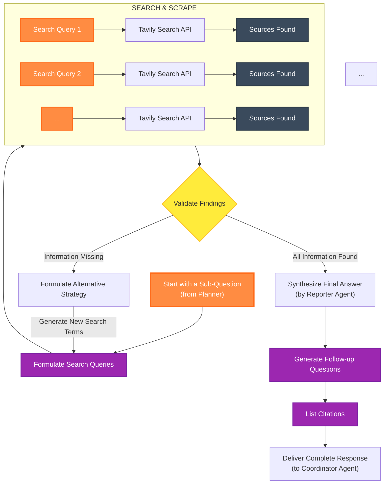

# Narada AI - Deep Research Agent: Core Research Workflow (v2)

This document details the internal, self-correcting workflow of the **Research Team** agents. This process is initiated and supervised by the `Planner` agent as described in the `multi-agent-system-design.md`.

## 1. Workflow Philosophy

The research process is iterative and dynamic. It is not a simple, linear execution of steps. The agent constantly validates the information it finds and can adapt its strategy if it hits a dead end, ensuring a more thorough and reliable research outcome.

## 2. The Research & Validation Loop

The following diagram illustrates this advanced workflow:

## 3. Workflow Steps Explained

1.  **Receive Sub-Question**: The workflow begins when the `Planner` assigns a specific sub-question to the `Research Team`.

2.  **Formulate Search Queries**: The `Researcher` agent takes the sub-question and generates a set of diverse and specific search queries designed to find the answer.

3.  **Execute Search & Scrape**: For each query, the `Researcher` calls the configured search API (e.g., Tavily). It receives a list of source URLs and then scrapes the content from the most promising ones.

4.  **Validate Findings**: This is the critical step. After scraping the sources, the agent uses an LLM to perform two checks:
    *   **Relevance Check**: Does the gathered information actually answer the sub-question?
    *   **Completeness Check**: Is the answer complete? Or are there still gaps? (e.g., "We found the specs, but not the price.")

5.  **Adaptive Strategy Formulation (The "Retry" Loop)**:
    *   **If information is missing or irrelevant**, the agent enters a "retry" loop.
    *   It analyzes *why* the initial search failed (e.g., "The term 'price' was too generic").
    *   It then formulates an **alternative strategy**, generating new, more creative, or more specific search terms (e.g., "MSRP cost", "pricing leak", "price comparison").
    *   It then goes back to Step 2 with these new search queries and tries again. This loop continues until the information is found or a maximum number of retries is reached.

6.  **Synthesize Final Answer**:
    *   **Once all information is validated as complete**, the findings are passed to the `Reporter` agent.
    *   The `Reporter` uses an LLM to synthesize all the verified, raw data into a single, coherent, and well-structured answer for the initial sub-question.

7.  **Generate Follow-ups & Citations**: The `Reporter` also generates a list of potential follow-up questions the user might have and compiles a list of all the sources that were used to generate the answer.

8.  **Deliver Response**: The complete package (the answer, follow-up questions, and citations) is handed back to the `Coordinator` to be presented to the user.