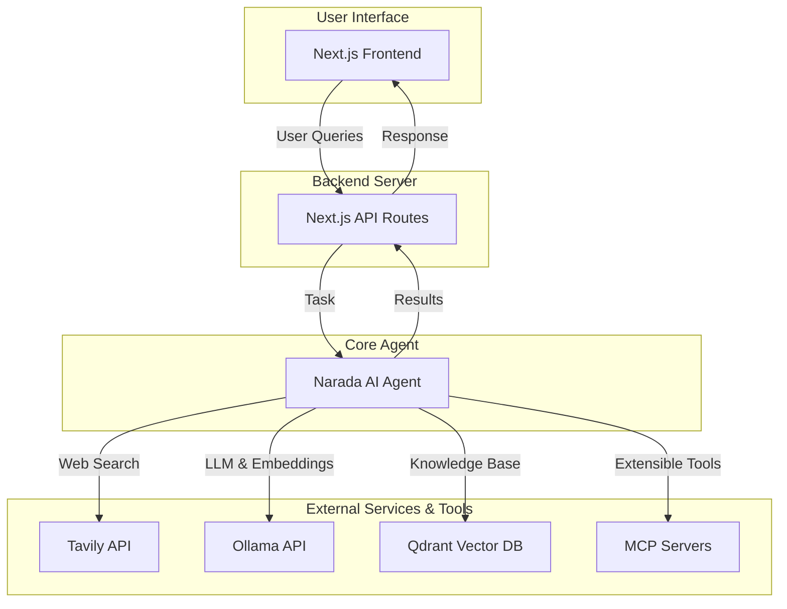

# Narada AI - Deep Research Agent: High-Level Architecture

This document outlines the high-level architecture for the "Narada AI - Deep Research Agent".

## System Components

The system is composed of the following key components:

1.  **Frontend (Next.js)**: A responsive and intuitive user interface built with Next.js and React. This is the primary point of interaction for the user.
2.  **Backend (Next.js API Routes)**: Server-side logic hosted as API routes within the Next.js application. This layer will handle business logic, API integrations, and communication with the core agent.
3.  **Core Agent Logic**: The central processing unit of the system. This agent will be responsible for understanding user queries, planning research tasks, executing them using available tools, and synthesizing the results.
4.  **Tavily API Integration**: Provides the agent with powerful and accurate web search capabilities.
5.  **Ollama Integration**: Enables the use of local or remote large language models (LLMs) for text generation and reasoning, and embedding models for creating vector representations of text.
6.  **Qdrant Vector Database**: A local vector database used to create, store, and search knowledge bases. This allows the agent to perform research against user-provided documents.
7.  **MCP Server Support**: The architecture will include a mechanism to connect to and utilize tools from MCP (Model-Context-Protocol) servers, making the agent extensible.

## Architecture Diagram

The following diagram illustrates the interaction between the components:

## Data Flow

1.  The user submits a research query through the **Next.js Frontend**.
2.  The query is sent to the **Next.js API Routes**.
3.  The API route invokes the **Narada AI Agent** with the research task.
4.  The agent breaks down the task and uses a combination of tools:
    *   It queries the **Tavily API** for real-time web search.
    *   It utilizes the **Ollama API** to generate text, summarize articles, or create embeddings.
    *   It searches the **Qdrant Vector DB** for relevant information from the user's knowledge bases.
    *   It can call upon any connected **MCP Servers** for specialized tools.
5.  The agent synthesizes the gathered information.
6.  The final result is sent back through the API route to the frontend for display to the user.